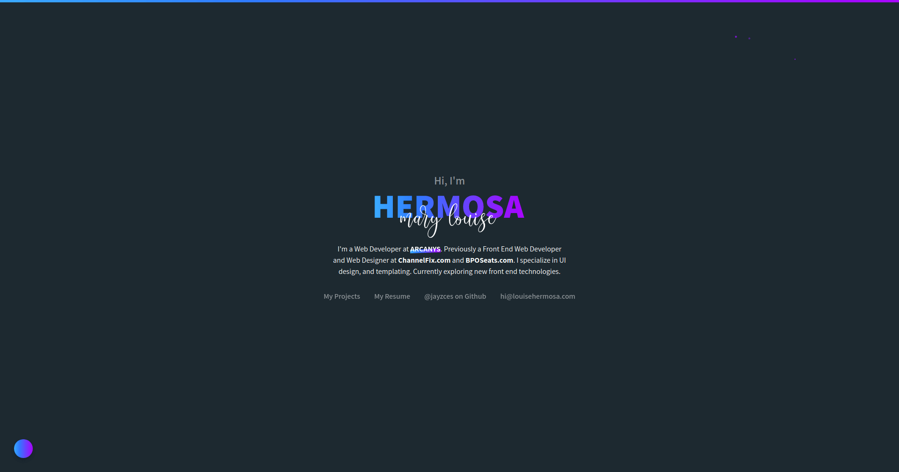

[](https://app.netlify.com/sites/clever-pike-f48452/deploys)

website
========
Source code for LouiseHermosa.com



# Run
### Local server
Main server:
```
npm run serve
```

API server:
```
npm run functions
```

### Production Build
```
npm run build
```
### Environment Variables
Prefixed with `VUE_APP_` for access in Vue Project
```
VUE_APP_CLIENT_ID=0
VUE_APP_CLIENT_SECRET=0
VUE_APP_FUNCTIONS_URL=http://localhost:9000
```
Replace `VUE_APP_FUNCTIONS_URL` in production with the base URL.

# Sources
- [Assistant Fonts](https://fonts.google.com/specimen/Assistant)
- [Cattieshine Font](https://befonts.com/cattieshine-script-font.html)
